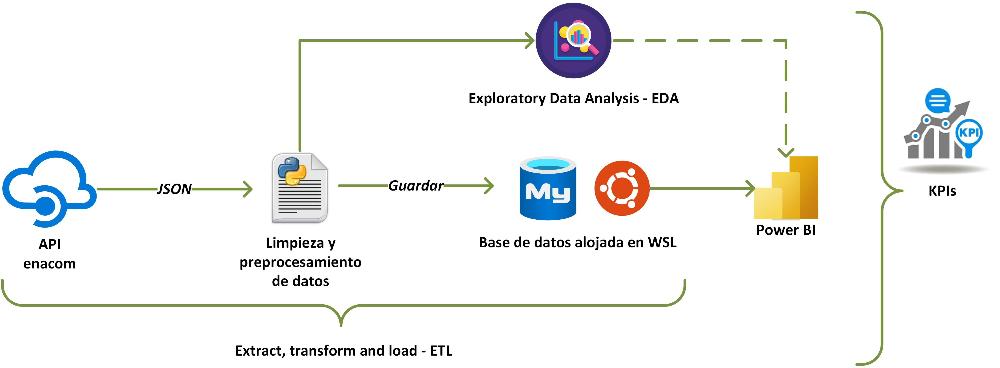
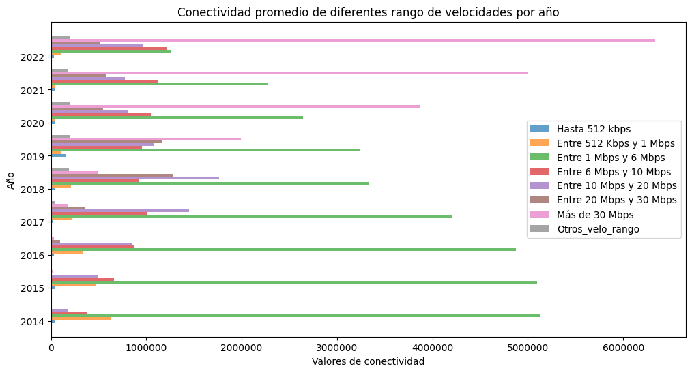
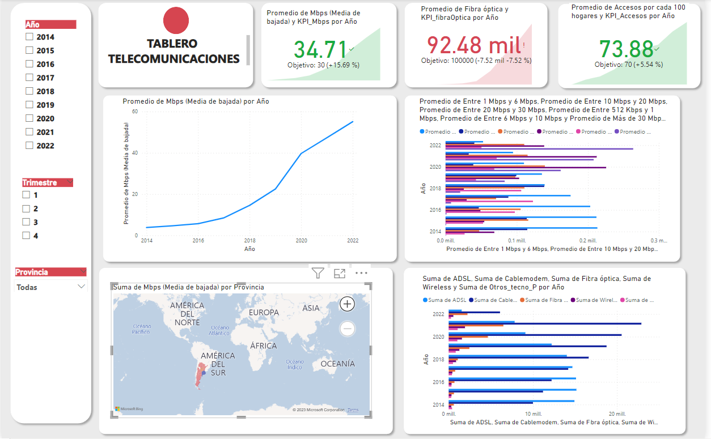

<h1 align='center'>
 <b>PROYECTO INDIVIDUAL Nº2 - TELECOMUNICACIONES</b>
</h1>

## 1. INTRODUCCION
Las telecomunicaciones se refieren a la transmisión de información a través de medios electrónicos, como la telefonía, la televisión, la radio y, más recientemente, el internet. Estos medios de comunicación permiten la transmisión de información entre personas, organizaciones y dispositivos a largas distancias.

La industria de las telecomunicaciones ha jugado un papel vital en nuestra sociedad, facilitando la información a escala internacional y permitiendo la comunicación continua incluso en medio de una pandemia mundial. La transferencia de datos y comunicación se realiza en su mayoría a través de internet, líneas telefónicas fijas, telefonía móvil, y en casi cualquier lugar del mundo.

En este contexto, una empresa prestadora de servicios de telecomunicaciones me encargó  la realización de un análisis completo que permita reconocer el comportamiento de este sector a nivel nacional. Considerando que la principal actividad de la empresa es brindar acceso a internet, pero también es importante considerar el comportamiento asociado al resto de los servicios de comunicación, con el fin de orientar a la empresa en brindar una buena calidad de sus servicios, identificar oportunidades de crecimiento y poder plantear soluciones personalizadas a sus posibles clientes.

---

## 2. PROPUESTA
La propuesta se organiza de la siguiente manera:
- **ETL(Extract, transform, and load):** Los datos son solicitados por medio de la API y exportados como archivos CSVs (Comma Separated Values), luego se hace la limpieza o el preprocesamiento de los datos para que sean data útil, estos datos son insertados a nuestra base de datos que se encuentra en nuestro servidor WSL (windows subsystem for linux).
- **EDA (Exploratory Data Analysis):** En este proceso se analizaron las diversas relaciones entre las variables de nuestra Data.
- **Dashboard**: Los datos son importados desde nuestra base de datos a Power BI para realizar un dashboard con las gráficas más importantes y los KPI's propuestos.

El proceso de la propuesta de detalla en la siguiente imagen: 

> :warning: **Warning:** Es importante remarcar que los datos utilizados solo cotemplan hasta el 1er trimestre del año 2022, debido a que el API no proporcionaba todos los datasets.

### 2.1 ETL
Los datasets proporcionados por la API (<a href="https://datosabiertos.enacom.gob.ar/dashboards/20000/acceso-a-internet/" target="_blank">datasets</a>) fueron descargados mediante un script de python [API Request](./API_request.ipynb), por medio del cual se fue consultando la información que se usará en el proceso de análisis, luego los datos fueron guardados en archivos csv en dos tipos estos archivos se encuentra en la carpeta Datasets :
- Con ID (para la base de datos):
    - tabla_trimes.csv: Csv en el formato para agregarse a la Base de datos con información de internet basado en      promedios trimestrales
    - tabla_provincias:Csv en el formato para agregarse a la Base de datos con información de internet basado en las provincias
    - tabla_provincias: Csv en el formato para agregarse a la Base de datos con información de internet basado en las localidades
   
- Sin ID (para el EDA):
    - datos_trimes_sinID.csv: Información de internet basado en promedios trimestrales
    - datos_localidades_sinID:Información de internet sobre las localidades
    - datos_provincias_sinID: Información de internet sobre las provincias

> :memo: **Nota:** en el proceso de transformación se elimaron y agregaron columnas, se arreglaron formatos de datos incompletos, se transformaron a tipos de datos correctos, y se unieron para facilidades de manipulación de la información, todo este proceso se detalla en el archivo: [ETL](./ETL.ipynb)

---

### 2.2 EDA
Para el análsis exploratorio de datos se utilizó en los archivos CSVs **_sinID** , por medio del cual se llegaron a algunas conclusiones importantes (solo detallaremos 02):

> :bulb: **Tip:** Recuerda que el EDA a más a detalle lo encontrarás en el archivo [EDA.ipynb](./EDA.ipynb) 

- **Relacion entre año y rango de velocidad:** *Podemos observar que a medida que pasan los años los rango de velocidad de 1 mbps a 6mbps decrece y el rango de mas de 30mbps aumenta*

- **Relacion entre año, provincia y Mbps (Media de bajada):** *Podemos observar que a medida que pasan los años la media de bajada aumenta por cada provincia, esto debido a las exigencias de cada año respecto a la velocidad, es importante tomar en consideración la población.*

")

---

### 2.3 Dashboard
En la siguiente imagen se describe el dashboard utilizado

